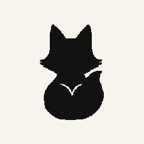
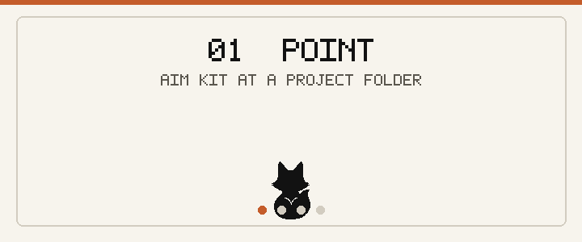
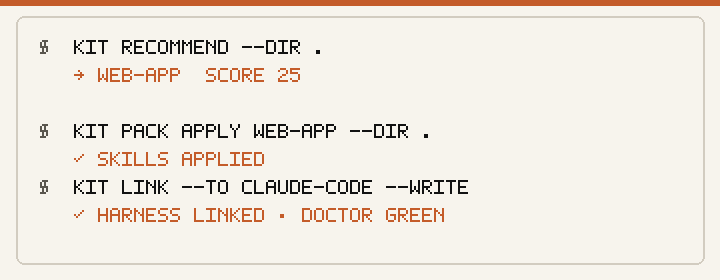
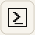
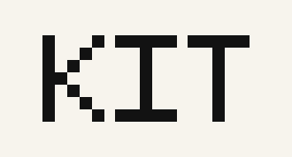

<p align="center">
  
</p>

<p align="center">
  
</p>

<p align="center">
  <strong>One library. Many agents.</strong><br />
  Point Kit at a project. Install a starter pack.<br />
  Wire skills into Claude Code, Grok Build, and Codex.
</p>

<p align="center">
  <a href="#quick-start"></a>
  <a href="#starter-packs"></a>
  <a href="#tui"></a>
  <a href="LICENSE"></a>
</p>

<p align="center">
  <a href="#quick-start">Quick start</a>
  ·
  <a href="#how-it-works">How it works</a>
  ·
  <a href="#starter-packs">Packs</a>
  ·
  <a href="#tui">TUI</a>
  ·
  <a href="#cli">CLI</a>
  ·
  <a href="docs/STARTER_PACKS.md">Docs</a>
  ·
  <a href="https://github.com/Zwin-ux/kit/releases/tag/v0.1.0-alpha">Alpha</a>
</p>

---

## How it works

<p align="center">
  
</p>

<p align="center">
  
</p>

| Step | What happens |
|------|----------------|
| **Point** | Aim Kit at a repo folder |
| **Recommend** | Score the right pack + skills from real signals |
| **Install** | Land a curated pack in the offline library |
| **Link** | Wire skills into Claude Code, Grok Build, or Codex |

<p align="center">
  
</p>

**Kit** is the portable skills layer for coding agents — strict `SKILL.md`, offline library, seven starter packs, and a pixel TUI with kit-idle.

---

## Quick start

**Need:** Node 20+ · [pnpm](https://pnpm.io) 10

```bash
git clone https://github.com/Zwin-ux/kit.git
cd kit
pnpm install && pnpm build
```

<table>
<tr>
<td width="50%" valign="top">

**Windows**

```powershell
.\kit.cmd recommend --dir .
.\kit.cmd init --pack essentials
.\kit.cmd pack apply essentials --dir .
.\kit.cmd link --to claude-code --write
.\kit.cmd doctor
.\kit.cmd tui
```

</td>
<td width="50%" valign="top">

**macOS / Linux**

```bash
pnpm kit -- recommend --dir .
pnpm kit -- init --pack essentials
pnpm kit -- pack apply essentials --dir .
pnpm kit -- link --to claude-code --write
pnpm kit -- doctor
pnpm kit -- tui
```

</td>
</tr>
</table>

Run from the repo root after build (`.\kit.cmd` or `pnpm kit --`).

---

## Starter packs

Seven kits. Stack packs **extend essentials**, so base skills always ride along.

<p align="center">
  
  &nbsp;&nbsp;
  
  &nbsp;&nbsp;
  
  &nbsp;&nbsp;
  
  &nbsp;&nbsp;
  
  &nbsp;&nbsp;
  
  &nbsp;&nbsp;
  
</p>

| | Pack | Best for |
|:---:|:-----|:---------|
|  | **essentials** | Any repo — start here |
|  | **web-app** | Apps and sites |
|  | **library** | Packages and SDKs |
|  | **cli-tool** | Developer CLIs |
|  | **api-service** | HTTP backends |
|  | **full-stack** | UI + API products |
|  | **data-ml** | Data and ML work |

```bash
pnpm kit -- recommend --dir ../my-app
pnpm kit -- pack install web-app
pnpm kit -- pack apply web-app --dir ../my-app
```

→ [docs/STARTER_PACKS.md](docs/STARTER_PACKS.md)

---

## Point → recommend → install

```bash
pnpm kit -- recommend --dir ~/code/my-next-app
```

```text
my-next-app looks like a web app → web-app
Signals: package.json, web-framework, tests

Packs
★ web-app       score 25  Web App
  essentials    score 8   Essentials
  …

Skills this project likely wants
  · a11y-pass · ship-checklist · pr-ready · write-tests
```

In the TUI: press **`o`**, type a path, hit Enter. Home shows the ★ line and suggested skills.

---

## TUI

<p align="center">
  
</p>

```bash
pnpm tui          # or  .\kit.cmd tui
```

| Key | What happens |
|:---:|:-------------|
| **1–7** | Install a starter pack (first-run) |
| **↵** | Install the selected toolkit |
| **a** | Apply pack to the pointed project |
| **o** | Point Kit at a project folder |
| **k** | Paths — pick harness, approve folder, link |
| **d** | Doctor |
| **e** | Explore registry |
| **l** | Library · **v** validate · **t** test |
| **q** | Quit |

kit-idle is the product face. Motion is short and purposeful.  
Set `KIT_REDUCED_MOTION=1` to skip delays.

→ [docs/TUI_SCREENS.md](docs/TUI_SCREENS.md)

---

## CLI

| Command | Job |
|---------|-----|
| `init --pack <name>` | First-run install |
| `pack list` / `install` / `apply` | Starter packs |
| `recommend --dir <path>` | Suggest pack + skills |
| `paths` / `link --to <harness> --write` | Wire into agents |
| `test` / `doctor` | Quality + health |
| `login` / `whoami` / `logout` | GitHub sign-in |
| `explore packs` / `search` | Registry catalog |
| `tui` | Pixel interface |

---

## Skill format

```yaml
---
name: pr-ready
description: Prepare a clear pull request summary, test plan, and risk notes.
version: 0.1.0
compatibility:
  - claude-code
  - grok-build
  - codex
---
```

Strict front matter. Clear body. Multi-agent compatibility.  
→ [docs/SKILL_SCHEMA.md](docs/SKILL_SCHEMA.md) · [skills/](skills/)

---

## Alpha

| Ready now | Next |
|-----------|------|
| Engine · 7 packs · silhouettes | Workshop |
| Pixel TUI · kit-idle · motion | Publish API |
| Recommend · link · doctor | Durable catalog |
| GitHub sign-in · explore | Global install |

[ROADMAP](ROADMAP.md) · [ARCHITECTURE](ARCHITECTURE.md) · [CHANGELOG](CHANGELOG.md) · [CI](.github/CI.md)

---

## Develop

```bash
pnpm install && pnpm build
pnpm test && pnpm typecheck
pnpm kit -- doctor
```

Regenerate README marketing assets (paper-bg banner, GIFs, pack tiles):

```bash
python packages/tui/scripts/generate-readme-assets.py
```

[CONTRIBUTING.md](CONTRIBUTING.md) · [AGENTS.md](AGENTS.md) · [docs/PIXEL_ART.md](docs/PIXEL_ART.md)

---

<p align="center">
  <br />
  <br />
  <sub>Skills your agents actually use.</sub>
</p>

<p align="center">
  <sub>MIT · <a href="LICENSE">License</a> · <a href="https://github.com/Zwin-ux/kit/releases/tag/v0.1.0-alpha">v0.1.0-alpha</a></sub>
</p>
