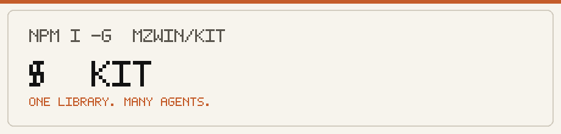
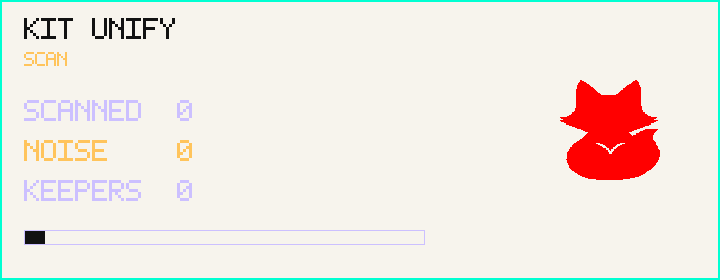
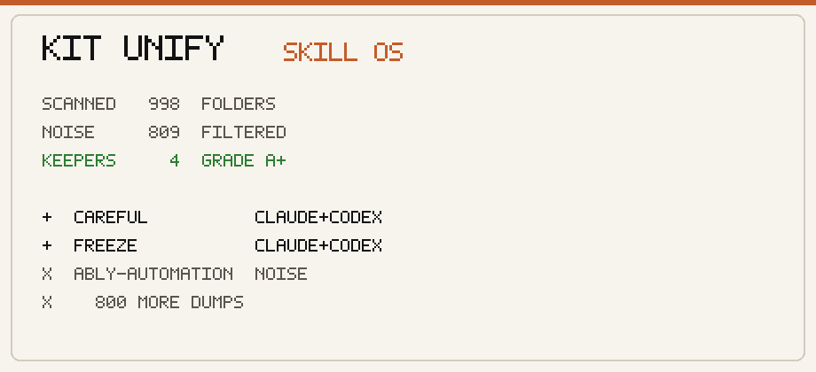
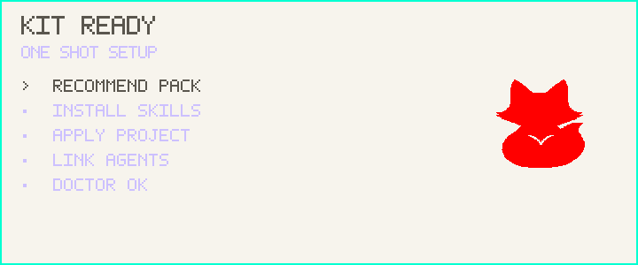
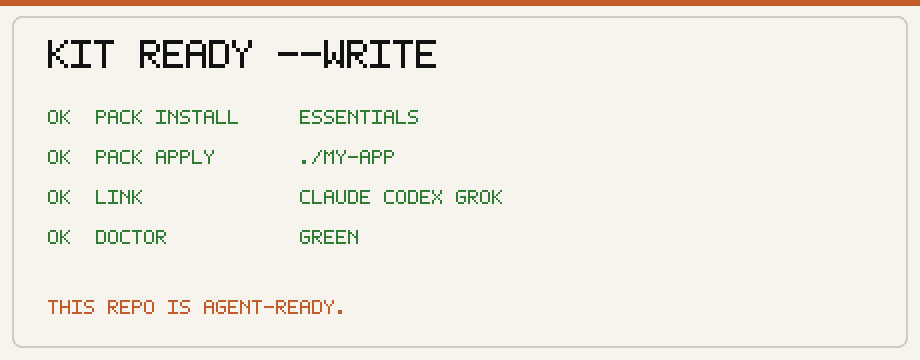
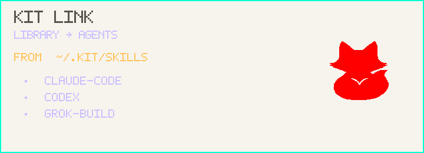
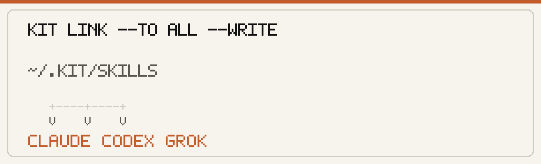
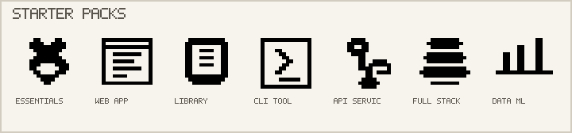
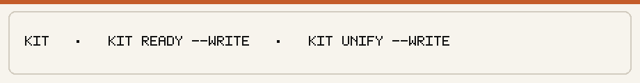
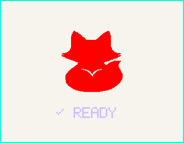

<p align="center">
  
</p>

<p align="center">
  
</p>

<p align="center">
  <strong>One library. Many agents.</strong><br />
  Install skills once. Use them in Claude Code, Codex, and Grok.
</p>

<p align="center">
  <a href="https://www.npmjs.com/package/@mzwin/kit"></a>
  <a href="LICENSE"></a>
</p>

---

<p align="center">
  
</p>

```bash
npm i -g @mzwin/kit
kit --version
```

```bash
kit                       # status + next step
kit ready --write         # set up this project
kit unify --write --link  # clean agent skill folders into one library
```

---

<p align="center">
  
</p>

<p align="center"><sub>Scan agent folders. Drop noise. Keep what earns a place.</sub></p>

<p align="center">
  
</p>

---

<p align="center">
  
</p>

<p align="center"><sub>Recommend · install · apply · link · doctor. One command.</sub></p>

<p align="center">
  
</p>

---

<p align="center">
  
</p>

<p align="center"><sub>Library → Claude · Codex · Grok.</sub></p>

<p align="center">
  
</p>

---

## Starter packs

<p align="center">
  
</p>

A pack is a set of skills for one project type.  
Most packs include **essentials**, then add extra skills.

| Pack | Use when | Extra skills (beyond essentials) |
|------|----------|-----------------------------------|
| **essentials** | Any project. Install this first. | — |
| **web-app** | Sites and UI apps | ship-checklist, a11y-pass, pr-ready |
| **library** | Packages and SDKs | api-docs, changelog, pr-ready |
| **cli-tool** | Command-line tools | cli-help, pr-ready |
| **api-service** | HTTP APIs and backends | api-docs, ship-checklist, pr-ready |
| **full-stack** | UI + API products | ship-checklist, a11y-pass, api-docs, pr-ready |
| **data-ml** | Data and ML work | data-check, write-tests, pr-ready |

```bash
kit pack list
kit recommend --dir .
kit pack apply essentials --dir .
```

---

## Skills

Each skill is a short instruction file. Agents load it when the task matches.

| Skill | What it does |
|-------|----------------|
| **add-readme** | Write a clear project README |
| **project-setup** | Set a clean project baseline for agents and humans |
| **workspace-setup** | Set monorepo and multi-package layout |
| **code-review** | Review a change for correctness, risk, and clarity |
| **write-tests** | Add tests for important behavior |
| **fix-bug** | Find root cause and fix a bug without extra refactors |
| **pr-ready** | Write PR summary, test plan, and risk notes |
| **ship-checklist** | Run a pre-ship checklist for an app release |
| **a11y-pass** | Improve basic accessibility for UI and web flows |
| **api-docs** | Document a library or service API with examples |
| **changelog** | Write a clear changelog entry |
| **cli-help** | Improve CLI help text, usage, and flags |
| **data-check** | Review data scripts and notebooks for clarity and reuse |

```bash
kit list
kit pack show essentials
```

Full pack notes: [docs/packs.md](docs/packs.md)

---

<p align="center">
  
</p>

| Command | Purpose |
|---------|---------|
| `kit` | Show library status and a next command |
| `kit ready --write` | Recommend pack, install, apply, link agents, run doctor |
| `kit unify --write` | Scan Claude/Codex/Grok skills, keep good ones, drop noise |
| `kit unify --write --link` | Same, then link skills into this project |
| `kit recommend --dir .` | Suggest a pack from project files |
| `kit pack apply <name> --dir .` | Copy pack skills into a project |
| `kit link --to all --write` | Link library skills to Claude, Codex, and Grok |
| `kit import --from claude-code --write` | Copy skills from one agent into Kit |
| `kit doctor` | Check install health |
| `kit tui` | Open the pixel terminal UI |

---

## How it works

1. Skills live in a local library (`~/.kit`).
2. Packs install groups of skills into that library.
3. `link` makes those skills available to each agent.
4. `unify` imports and cleans skills that already exist in agent folders.

Agents: **Claude Code** · **Codex** · **Grok Build**.

---

## From source

```bash
git clone https://github.com/Zwin-ux/kit.git
cd kit
pnpm install && pnpm build
pnpm kit -- doctor
```

---

<p align="center">
  
</p>

<p align="center">
  <br />
  <sub>Skills your agents use.</sub>
</p>

<p align="center">
  <sub>
    <a href="LICENSE">MIT</a> ·
    <a href="https://www.npmjs.com/package/@mzwin/kit">npm</a> ·
    <a href="CHANGELOG.md">Changelog</a>
  </sub>
</p>
