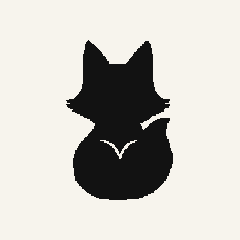
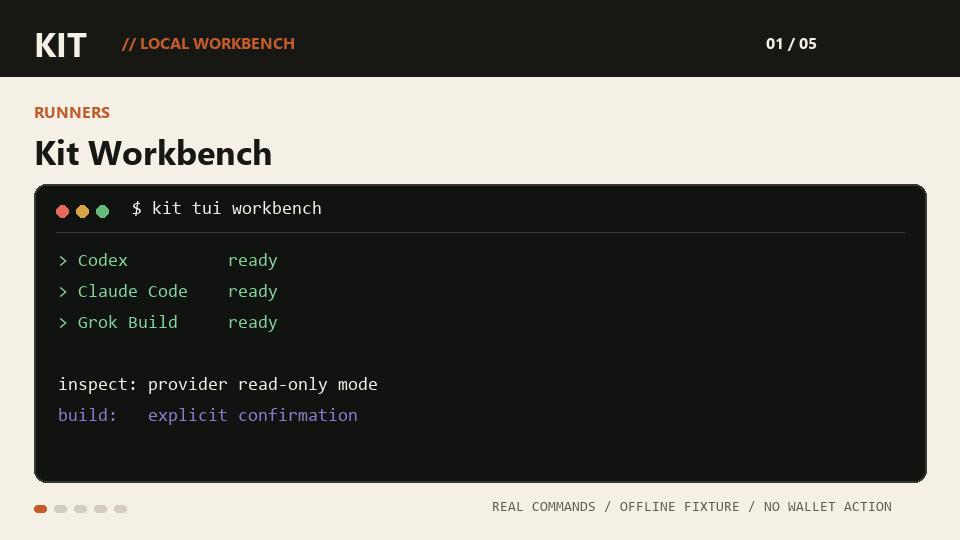
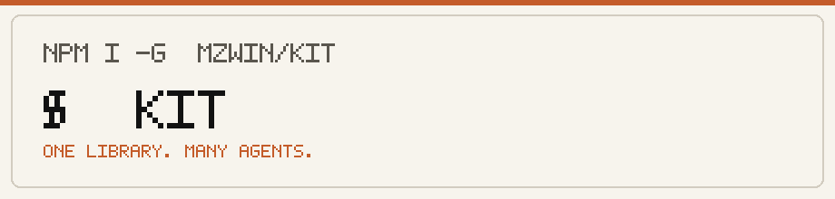
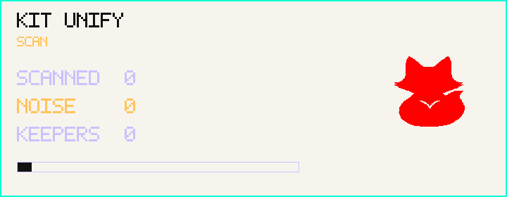
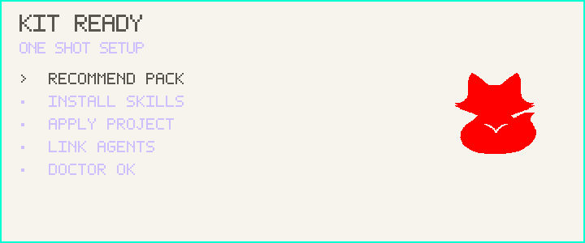
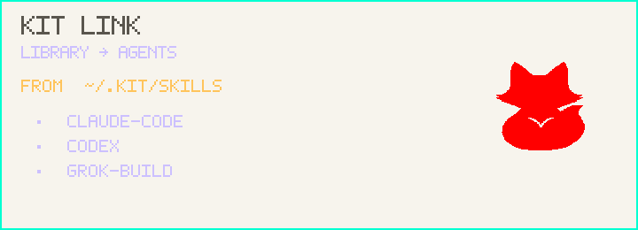
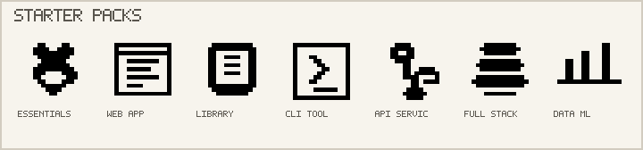
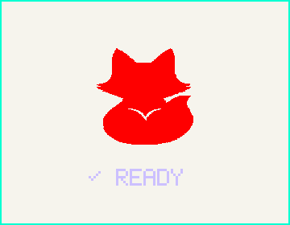
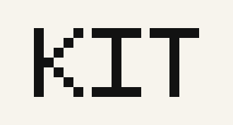

<p align="center">
  
</p>

<p align="center">
  
</p>

<p align="center">
  <strong>A local workbench for Codex, Claude, Grok, Ollama, and the tools beside your code.</strong><br />
  Point at a repo. Run one bounded job. Keep the proof.
</p>

<p align="center">
  <a href="https://www.npmjs.com/package/@mzwin/kit"></a>
  <a href="LICENSE"></a>
</p>

---

## Install

```bash
npm i -g @mzwin/kit
kit --version
```

Node 20+. Command name: `kit`.

```bash
kit                  # status + next command
kit ready --write    # pack → install → apply → link → doctor
kit unify --write --link
kit tui              # setup this project (install skills + link agents)
kit tui workbench    # advanced multi-lane menu
```

---

## Action Terminal

<p align="center">
  
</p>

The Action Terminal takes over the terminal while it runs. Your shell and
scrollback return when Kit exits. Dense layouts stay readable from 60x18 through
a maximized window.

- **Skills** — install and apply packs without leaving the log.
- **Agents** — Codex, Claude Code, Grok Build, and local Ollama (start serve, pull models, run jobs).
- **Services** — fixed read-only tasks from registered CLI plugins (e.g. market/health).
- **Ops** — Ready plan, Unify plan, Doctor, Paths, Refresh.

Write one job in the TUI. `inspect` uses the provider's read-only or plan mode.
`build` can edit the selected repo and needs a separate confirmation. Kit uses
the provider's existing login. It does not store model API keys. Output streams
inside the Workbench, and `Esc` stops a running job or service task.

`Tab` switches between Runners and Services. The main panel always describes
the selected lane. The footer changes with the current action, so prompt,
confirmation, run, and stop keys stay visible on small terminals. Run state
uses words such as `RUNNING`, `STOPPING`, `DONE`, and `FAILED`; color is not
required. `Q` quits from navigation, but it remains normal text while you edit
a prompt. `Ctrl+C` always exits.

Ollama runs through its official Codex launch bridge. This gives the local
model the same repository tools and sandbox as a normal Codex job. Kit isolates
the local run from unrelated global connectors so they do not consume the
model's context.

```bash
kit tui terminal
# Agents lane (2): press o to start Ollama if offline, p to pull a model
```

Or start Ollama yourself, then open the terminal:

```bash
ollama serve
ollama pull <model>
kit tui terminal
```

Select **Ollama · Codex**, then use left and right to choose an installed model.
Kit can start a kit-managed `ollama serve` (`o`) and stop only what it started
(`O`). It does not send project content to a hosted model for local runs.
Set `KIT_NO_ALT_SCREEN=1` only when you need inline terminal output for debugging.

Trenchwire is the first attached service. Its `health` and `market` tasks use
fixed arguments. Wallet login, signing, submission, and the literal `SEND`
gate stay inside Trenchwire.

```bash
kit plugin add ../trenchwire --write
kit tui workbench
```

The proof above uses the compiled Trenchwire binary, recorded market data, and
live runner detection. It does not connect a wallet or submit a trade.

Read the [Workbench architecture](docs/dev/WORKBENCH_ARCHITECTURE.md).

---

<p align="center">
  
</p>

---

## Clean agent skill folders

<p align="center">
  
</p>

<p align="center"><sub>Scan · filter noise · keep what earns a place.</sub></p>

```bash
kit unify
kit unify --write
kit unify --write --link
```

---

## One-shot project setup

<p align="center">
  
</p>

<p align="center"><sub>Recommend · install · apply · link · doctor.</sub></p>

```bash
kit ready
kit ready --write
kit ready --write --unify
```

---

## Link the library to agents

<p align="center">
  
</p>

<p align="center"><sub>Library → Claude · Codex · Grok.</sub></p>

```bash
kit link --to all --write
kit import --from claude-code --write
```

---

## Attach a CLI service

Kit can run a local CLI from its own checkout. The plugin supplies one small
manifest.

```bash
kit plugin add ../trenchwire --write
kit plugin doctor trenchwire
kit plugin task trenchwire
kit plugin task trenchwire health
kit plugin task trenchwire market
```

Kit stores the plugin path and manifest digest. It does not copy the binary.
Kit passes arguments without a shell. The plugin keeps its own safety rules.
Kit stops if the manifest changes after registration.

Read the [plugin contract](docs/plugins.md).

---

## Starter packs

<p align="center">
  
</p>

A pack is a skill set for one project type. Most extend **essentials**.

| Pack | Use when | Extra skills |
|------|----------|--------------|
| **essentials** | Any project. Start here. | — |
| **web-app** | Sites and UI | ship-checklist, a11y-pass, pr-ready |
| **library** | Packages and SDKs | api-docs, changelog, pr-ready |
| **cli-tool** | CLIs | cli-help, pr-ready |
| **api-service** | HTTP APIs | api-docs, ship-checklist, pr-ready |
| **full-stack** | UI + API | ship-checklist, a11y-pass, api-docs, pr-ready |
| **data-ml** | Data / ML | data-check, write-tests, pr-ready |

```bash
kit pack list
kit recommend --dir .
kit pack apply essentials --dir .
```

---

## Skills

Short instruction files. Agents load them when the task matches.

| Skill | Does |
|-------|------|
| **add-readme** | Project README |
| **project-setup** | Clean baseline for agents and humans |
| **workspace-setup** | Monorepo / multi-package layout |
| **code-review** | Correctness, risk, clarity |
| **write-tests** | Tests for important behavior |
| **fix-bug** | Root cause + fix without drive-by refactors |
| **pr-ready** | PR summary, test plan, risk |
| **ship-checklist** | Pre-ship checklist |
| **a11y-pass** | Basic UI accessibility |
| **api-docs** | API docs with examples |
| **changelog** | Changelog entry |
| **cli-help** | Help text, usage, flags |
| **data-check** | Data scripts / notebooks |

```bash
kit list
kit pack show essentials
```

More: [docs/packs.md](docs/packs.md)

---

## Commands

| Command | Purpose |
|---------|---------|
| `kit` | Status + next step |
| `kit ready --write` | Make this repo agent-ready |
| `kit unify --write` | Clean Claude/Codex/Grok skill dumps |
| `kit unify --write --link` | Clean + link into the project |
| `kit recommend --dir .` | Suggest a pack |
| `kit pack apply <name> --dir .` | Apply pack skills |
| `kit link --to all --write` | Link library to agents |
| `kit import --from claude-code --write` | Import from one agent |
| `kit plugin add <path> --write` | Register a local CLI |
| `kit plugin doctor <name>` | Check its binary and manifest |
| `kit plugin task <name> [task]` | List or run a fixed read-only task |
| `kit plugin run <name> -- <args>` | Run it without a shell |
| `kit doctor` | Install health |
| `kit tui` | Terminal UI |
| `kit tui workbench` | Coding runners and attached services |

---

## How it works

1. Skills and plugin registrations live in `~/.kit`.
2. Packs install groups into the skill library.
3. `link` exposes skills to each coding runner.
4. Workbench starts provider CLIs and service tasks without a shell.
5. `unify` imports and cleans skills already in agent folders.

**TUI:** menu screens keep the mascot in a fixed rail. Workbench gives the job
and output the full terminal. `KIT_REDUCED_MOTION=1` freezes motion.

Agents: **Claude Code** · **Codex** · **Grok Build**.

---

## From source

```bash
git clone https://github.com/Zwin-ux/kit.git
cd kit
pnpm install && pnpm build
pnpm kit doctor
pnpm kit tui
# or:  pnpm tui
# also: pnpm kit -- tui   (npm-style; leading -- is stripped)
```

Run from the **repo root**, not your home folder. `kit tui` needs an interactive terminal (real TTY).

---

<p align="center">
  
</p>

<p align="center">
  <br />
  <sub>Skills your agents use.</sub>
</p>

<p align="center">
  <sub>
    <a href="LICENSE">MIT</a> ·
    <a href="https://www.npmjs.com/package/@mzwin/kit">npm</a> ·
    <a href="CHANGELOG.md">Changelog</a>
  </sub>
</p>
