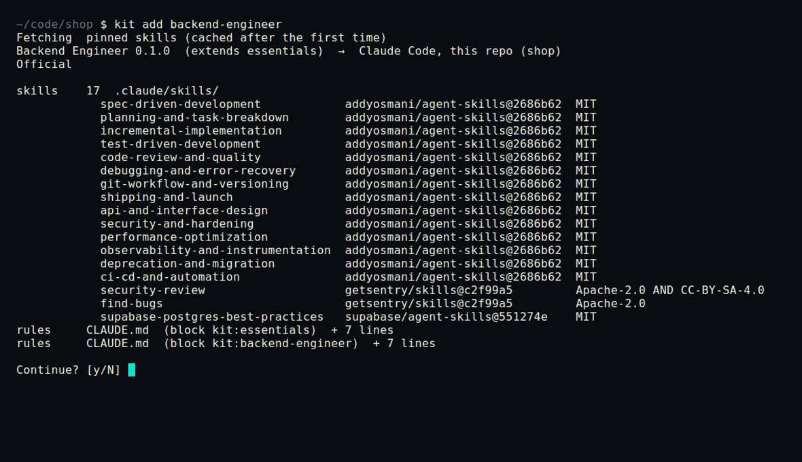
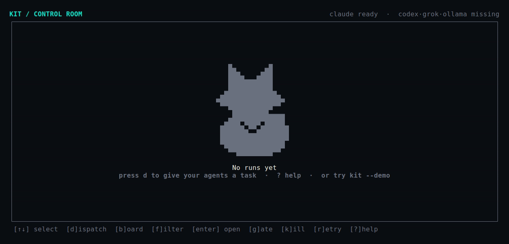
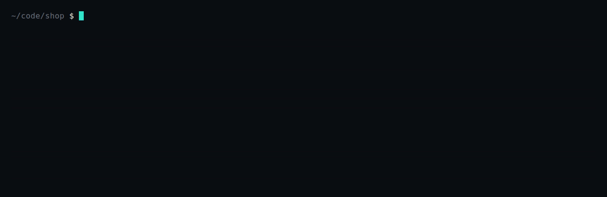

<p align="center">
  <strong>Kit sets your coding agents up for one job, then proves what they do.</strong><br />
  Kits for Claude Code, Codex and Grok: skills, rules, MCP servers and hooks, installed in one step and removed exactly.
</p>

<p align="center">
  <a href="LICENSE"></a>
  
</p>

A **kit** is everything an agent needs for one kind of work. Frontend Design
brings skills for UI, accessibility and Core Web Vitals, the Chrome DevTools
MCP server so the agent can look at the page, and a hook that formats each
file it edits. Kit writes each piece in the format your agent reads, shows you
every file first, and can take it all out again.

<p align="center"></p>

<details>
<summary>The same first run as text</summary>

```console
$ npm install -g @mzwin/kit
$ kit
Kit sets your coding agents up for one job, then proves what they do.

Looking for agents on this machine…
  Claude Code   2.1.283
  Codex         not found
  Grok          not found

> Which agents should Kit set up? Claude Code
? What should your agents focus on?
> [x] Frontend Design      UI, design systems, accessibility, browser testing
  [ ] Full-stack Design    Frontend Design plus APIs, data, security, end-to-end tests
  [ ] Backend Engineer     APIs, databases, security, performance, observability
  [ ] LLM Engineer         Prompts, evals, RAG, model APIs, cost and latency
  [ ] iOS / Apple Design   Native iOS apps that look and feel like Apple's: SwiftUI, HIG, Liquid Glass, accessibility
  [ ] Essentials           Spec, plan, build in small steps, test, review, ship
> Install for All my projects   your agents use it everywhere

Frontend Design 0.1.0  (extends essentials)  →  Claude Code, all projects
Official

skills    13  ~/.claude/skills/
            frontend-design                anthropics/skills@3337550              Apache-2.0
            accessibility                  addyosmani/web-quality-skills@afa8da9  MIT
            core-web-vitals                addyosmani/web-quality-skills@afa8da9  MIT
            …
rules     ~/.claude/CLAUDE.md  (block kit:frontend-design)  + 7 lines
mcp       chrome-devtools → claude mcp add-json --scope user   RUNS CODE
hook      PostToolUse → ~/.claude/settings.json   RUNS CODE

Runs code on your machine: 2 (MCP servers, hooks and checks, each shown above).

Continue? [y/N], or s for skills and rules only (no code): y
Done. Claude Code has Frontend Design in all projects.
undo      kit remove frontend-design --global

Try it:
  claude "build a pricing page with three tiers"
  kit run "build a pricing page with three tiers"   (in its own worktree, proven by your checks)
```

</details>

That is the first run. After it, bare `kit` opens the Control Room.

---

## Kits

| Kit | For | Brings |
|-----|-----|--------|
| `frontend-design` | UI, design systems, accessibility, browser testing | 13 skills, Chrome DevTools MCP, format-on-edit hook |
| `fullstack-design` | Frontend Design plus APIs, data, security | 18 skills, Chrome DevTools MCP, format-on-edit hook |
| `backend-engineer` | APIs, databases, security, performance | 17 skills, including Sentry's security review and bug finding |
| `llm-engineer` | Prompts, evals, RAG, model APIs, cost | 16 skills, OpenAI docs MCP (remote, runs nothing locally) |
| `ios-apple-design` | Native iOS: SwiftUI, Apple's design guidelines, Liquid Glass, accessibility | 16 skills including Kit's own `apple-design`, Apple docs MCP (remote), XcodeBuildMCP, SwiftFormat/SwiftLint on edit |
| `essentials` | Any job: spec, plan, small steps, test, review | 8 skills; the base the others extend |

Every skill is free and open source, fetched from its author's repo at a
pinned commit: [addyosmani/agent-skills](https://github.com/addyosmani/agent-skills),
[addyosmani/web-quality-skills](https://github.com/addyosmani/web-quality-skills),
[anthropics/skills](https://github.com/anthropics/skills),
[getsentry/skills](https://github.com/getsentry/skills),
[supabase/agent-skills](https://github.com/supabase/agent-skills),
[AvdLee](https://github.com/AvdLee/SwiftUI-Agent-Skill),
[twostraws](https://github.com/twostraws/SwiftUI-Agent-Skill),
[Dimillian/Skills](https://github.com/Dimillian/Skills),
[PasqualeVittoriosi/swift-accessibility-skill](https://github.com/PasqualeVittoriosi/swift-accessibility-skill).
Kit's own `apple-design` skill summarises Apple's Human Interface Guidelines
in its own words and links each page; the guidelines themselves are read at
runtime through the [sosumi](https://github.com/NSHipster/sosumi.ai) MCP server, never copied.
`kit show <kit>` lists each skill with its source, commit and licence.

```bash
kit show                              # the kits
kit show frontend-design              # what it installs, before anything is written
kit add frontend-design --global      # all your projects
kit add llm-engineer --agent codex    # this repo only, Codex only
kit add backend-engineer --print      # the plan, nothing written
kit list                              # what is installed, and anything changed by hand
kit remove frontend-design --global   # exactly what was added, nothing else
kit doctor                            # agents found, and each kit's checks
kit doctor --start-mcp                # also start each kit's MCP servers once
```

<p align="center"></p>

Kits stack. Frontend Design and LLM Engineer can both be installed, and
Essentials, which both extend, installs once and stays until neither needs it.

## Where Kit writes

| Piece | Claude Code | Codex | Grok |
|-------|-------------|-------|------|
| skills | `~/.claude/skills/` or `.claude/skills/` | `~/.agents/skills/` or `.agents/skills/` | reads Claude Code's, or `.agents/skills/` |
| rules | a marked block in `~/.claude/CLAUDE.md` or `CLAUDE.md` | a marked block in `~/.codex/AGENTS.md` or `AGENTS.md` | reads both files |
| MCP | `claude mcp add-json --scope user`, or `.mcp.json` | `[mcp_servers]` in `~/.codex/config.toml` or `.codex/config.toml` | reads Claude Code's |
| hooks | `PostToolUse` in `settings.json` | not yet (the plan says so) | reads Claude Code's |

`--global` writes the home-directory column. Without it, Kit installs into the
git repo you are in. Kit keeps its record of what it installed in `~/.kit`, and
writes a copy to `kit.lock` in the repo for your team to commit. Kit never acts
on that copy: a repo you clone cannot choose what Kit runs or deletes. `kit list`
names any kit it lists that you have not installed.

`kit run` works in a clean checkout of your last commit, so the agent sees only
committed files. Commit the repo-scope files `kit add` wrote before `kit run` if
the agent should use them there.

## What Kit promises

- **Nothing is written before you see it.** The plan lists every folder, file
  block, config key and command. `--print` stops there.
- **Anything that runs code says so.** MCP servers and hooks are marked
  `RUNS CODE` and counted. `s` or `--no-code` installs skills and rules only.
- **Everything is pinned.** Skills by commit and content hash. A local MCP
  server starts through `npx`, `bunx`, `pnpm dlx` or `uvx` with one package
  at an exact version (never `@latest`, a range, a URL or a tarball), or is
  the server's own program already on your PATH. Kits cannot start a shell,
  an interpreter, or a wrapper such as `env` or `nohup`, and cannot pass
  inline code.
- **Your files stay yours.** Kit edits only between its own markers in
  `CLAUDE.md` and `AGENTS.md`, only its own keys in JSON and TOML (comments
  kept), and only skill folders it wrote. A folder you made is never overwritten.
- **Removal is exact.** Every change is recorded with its inverse in Kit's
  own record, never read from the repo. A skill you edited by hand is left
  in place and named.
- **A failed install changes nothing.** It rolls back what it did.
- **Known limits.** A change to a skill file's permissions alone is not seen
  as an edit. Kit's record for a repo is keyed on where the repo sits, so
  after moving or renaming the folder, `kit add` the kits again there.
- **No secrets, no telemetry.** Kits refer to environment variables by name.
  Fetching is `git` over HTTPS from the named repos.

## Write your own kit

A kit is a folder with a `KIT.toml`:

```toml
schema = 1

[kit]
name        = "my-kit"
title       = "My Kit"
version     = "0.1.0"
description = "What the agent should be good at"
extends     = ["essentials"]
example     = "a first task to try"

[rules]
file = "RULES.md"                       # added to CLAUDE.md / AGENTS.md

[[skill]]                               # from its author, at a pinned commit
name    = "frontend-design"
source  = "github:anthropics/skills"
path    = "skills/frontend-design"
rev     = "33375500bcea98d610eb30ce10ac4e59b89c390d"
licence = "Apache-2.0"

[[skill]]                               # or shipped inside the kit
name = "house-style"
path = "skills/house-style"

[mcp.chrome-devtools]
command = "npx"
args    = ["-y", "chrome-devtools-mcp@1.10.1", "--no-usage-statistics"]

[[hook]]                                # Kit's own: the project's formatter and linter
on   = "after_edit"
glob = "*.{ts,tsx,css}"
use  = "format-and-lint"                # or: run = "a command using $FILE"

[check]                                 # what kit doctor proves
mcp_starts = ["chrome-devtools"]        # with --start-mcp only
```

```bash
kit show ./my-kit
kit add ./my-kit --global
```

A kit from a folder is labelled `Direct source, not reviewed by Kit` above its
plan. The design, including the public index of kits that comes next, is in
[`docs/dev/DESIGN-KITS.md`](docs/dev/DESIGN-KITS.md).

---

## Prove what agents do

Kit also runs agents in isolated git worktrees and holds them to your repo's
own checks.

```bash
cd your-repo
kit init                                  # write kit.toml: the checks every run must pass
kit run "fix the failing test"            # one agent, its own worktree, then the checks
kit land <id>                             # a passed run's changes, on branch kit/<id>
kit                                       # the Control Room: every run, in one place
```

`kit init` reads `Cargo.toml`, `go.mod`, `package.json` or `pyproject.toml`,
proposes checks that do not change files, and runs each once before writing
them (`--drop-failing` leaves out the ones that fail today). A run with no checks is `UNCONFIGURED`, never a silent pass, and a run whose agent changed nothing reads `NO CHANGES`. Every run
writes a receipt to `~/.kit/runs/<id>/` (`kit receipt list`, `kit receipt show <id>`).

<p align="center"></p>

<p align="center"></p>

<sub>Recorded with a scripted stand-in for Claude Code ([docs/media/fakeagent.sh](docs/media/fakeagent.sh)); the worktree, checks, receipt and branch are Kit's own.</sub>

<p align="center"></p>

`kit --demo` opens it with sample runs. Keys: `↑↓` select · `f` filter ·
`Enter` open · `g` gate · `d` dispatch · `b` board · `k` kill · `r` retry
with the failure · `?` help · `q` quit.

Dispatch (`d`) sends one task to several agents and roles at once. Kit runs
eight at a time, queues the rest, and gives each its own worktree, checks and
receipt.

<p align="center"></p>

<sub>The agents in this recording are scripted stand-ins ([docs/media/fakeagent.sh](docs/media/fakeagent.sh)); Kit, the worktrees, the checks and the receipts are real.</sub>

---

## Install

Each line installs the same `kit` binary.

| Method | Command |
|--------|---------|
| npm | `npm install -g @mzwin/kit` |
| Linux, macOS | `curl -fsSL https://raw.githubusercontent.com/Zwin-ux/kit/main/scripts/install.sh \| sh` |
| Windows PowerShell | `irm https://raw.githubusercontent.com/Zwin-ux/kit/main/scripts/install.ps1 \| iex` |
| Cargo | `cargo install kitctl --locked` |

- The install scripts check the download's SHA-256 against `SHA256SUMS`,
  install to `~/.local/bin` (Windows: `%LOCALAPPDATA%\kit\bin`), and show the
  line to add if that is not on `PATH`.
- Linux builds need glibc 2.17 or newer. On musl (Alpine), use Cargo.
- `cargo install kit-cli` is a different project. Kit's crate is `kitctl`.

Kit uses each agent's own login and never stores API keys.
Details: [`docs/dev/RELEASING.md`](docs/dev/RELEASING.md).

From source:

```bash
git clone https://github.com/Zwin-ux/kit.git && cd kit
cargo run -p kitctl -- show
cargo run -p kitctl -- --demo
```

| Env | Effect |
|-----|--------|
| `KIT_HOME` | Where Kit keeps its records, config, cache and receipts (default `~/.kit`) |
| `KIT_FULL_AUTO=1` | Skip agent approval prompts in `kit run` (sandboxes only). Grok runs only with it: `grok -p` has no edit-only mode, so without it `kit run` does not start Grok |
| `KIT_AGENT_RUNS_CHECKS=1` | Let Claude Code run the gate's own commands during `kit run` (they run code the agent wrote, with your permissions). Claude's file tools may never edit `kit.toml`, `.git` or `.claude`, with or without this; the checks themselves are not bound by that. Off by default: Kit runs the gate after the agent finishes |
| `KIT_OLLAMA_MODEL` | Model for the Ollama adapter (default `llama3.2`) |
| `NO_COLOR` / `KIT_MOTION=off` | Monochrome / reduced motion |
| `KIT_THEME=high` | High-contrast palette |

JSON output for scripts: commands take `--json` ([contract](docs/json-contract.md)).
Architecture: [`docs/dev/CURRENT.md`](docs/dev/CURRENT.md).

<details>
<summary>Legacy: Kit 0.1.x npm workbench</summary>

The earlier `npm i -g @mzwin/kit` (0.1.x) was a Node skill workbench. It is
kept in `packages/` for history; Kit is now the Rust binary above. See
[Workbench architecture](docs/dev/WORKBENCH_ARCHITECTURE.md).

</details>

<p align="center">
  <sub><a href="LICENSE">MIT</a></sub>
</p>
