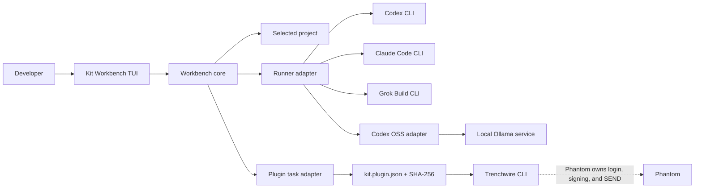

# Kit Workbench

## Goal

Kit Workbench is a local control desk for coding runners and project tools.

A user can:

- point Kit at one project;
- see which coding runners are installed;
- select a model from the local Ollama service;
- send one bounded job to a runner;
- choose read-only inspection or an explicit build run;
- see attached CLI services and their fixed read-only tasks;
- run a service task without learning raw command arguments.

Trenchwire is the first attached service. It keeps all wallet and trade rules.
Kit does not send wallet commands, score markets, or approve trades.

## Requirements

### Functional

- Detect Codex, Claude Code, Grok Build, and Ollama on the local machine.
- Read installed Ollama models from `GET /api/tags`.
- Run Ollama through its official Codex launch bridge.
- Build runner arguments without a shell.
- Keep inspection jobs read-only.
- Require an explicit confirmation before a build job.
- Register local CLI services by manifest digest.
- List fixed service tasks.
- Run only the fixed arguments declared for a service task.
- Show runner and service state in the TUI.
- Keep the current project path visible.
- Use the terminal's alternate screen and restore the shell on exit.
- Stream bounded runner output and let the user stop a running job.

### Non-functional

- **Local first:** no Kit server is needed.
- **Start time:** runner and service discovery should finish in under one second
  on a normal developer machine.
- **Bounded jobs:** a Workbench job has a timeout and a 256 KiB output limit.
- **Process safety:** Kit uses argument arrays and `shell: false`.
- **File safety:** inspect mode cannot write to the project through the runner
  permission mode.
- **Change safety:** build mode needs a separate confirmation.
- **Credential safety:** Kit does not store provider keys or copy provider
  login files.
- **Failure isolation:** one failed runner or service does not stop discovery
  of the other tools.
- **Compatibility:** the same contract works on Windows, macOS, and Linux.

## Architecture

## Component rules

### Workbench TUI

- Owns navigation, prompt input, status, and explicit confirmation.
- Does not build command arguments.
- Does not parse market or wallet data.
- Owns the full alternate terminal screen while Kit runs.
- Uses compact, standard, and wide layouts for 60x18, 80x24, and large terminals.
- Streams bounded output and restores the original shell on exit.
- It is a focused coding control surface, not a general-purpose PTY emulator.

### Workbench core

- Detects supported runner executables.
- Maps one runner and one mode to a fixed argument shape.
- Starts the child process without a shell.
- Enforces timeout and output limits.
- Returns a structured result to the CLI or TUI.
- Supports cancellation through an `AbortSignal`.

### Runner adapters

- `inspect` uses the provider's read-only or plan permission mode.
- `build` uses the provider's normal workspace-write mode.
- Kit does not bypass provider approvals or sandboxes.
- Hosted providers own authentication and model selection.
- For Ollama, Kit lists local models and passes the selected model through
  `ollama launch codex`.
- Ollama jobs receive an isolated Codex home under `~/.kit/runtime`. Global
  connectors and skill catalogs do not consume the local model's context.

### Plugin task adapter

- A task has a name, description, fixed arguments, and `read-only` access.
- Kit verifies the registered manifest digest before each run.
- Kit stops the task after 30 seconds.
- A task declaration is not a sandbox. The plugin still owns domain safety.

## Failure modes

| Failure | User effect | Mitigation |
| --- | --- | --- |
| Runner is missing | Runner shows `missing` | Keep other runners and services usable |
| Provider login expired | Job exits with provider error | Return the provider output; do not read its credentials |
| Ollama is stopped | Local runner shows `service offline` | Keep hosted runners and services usable |
| Ollama has no models | Local runner shows `no models` | Ask the user to pull a model |
| Project path is missing | Job cannot start | Validate the directory before spawn |
| Job hangs | Workbench stays busy | Stop it at the configured timeout |
| Output floods the TUI | Screen becomes unusable | Stop capture at 256 KiB and report truncation |
| Manifest changes | Service trust is stale | Block the task until the user registers it again |
| Service binary is missing | Task cannot start | Show the build or PATH repair step |
| Trenchwire task fails | Market task returns an error | Keep the error inside the service lane; do not infer a trade action |

## Technology choices

- Keep TypeScript and Ink. Both are already in Kit.
- Use child processes. Do not add a daemon for the first release.
- Use the installed provider CLIs. Do not add a second API-key store.
- Use Ollama's local tags endpoint only for discovery. Use Ollama's official
  Codex bridge for the coding-agent loop instead of building a second tool
  protocol.
- Keep runner adapters in `@mzwin/kit-core`.
- Keep the TUI as a client of the same core functions used by tests.

## Release slices

1. Fixed read-only service tasks with Trenchwire `health` and `market`.
2. Runner discovery and bounded `inspect` jobs.
3. Explicitly confirmed `build` jobs.
4. Saved job history after the process contract is stable.
5. Ollama model discovery, full-terminal layout, live output, and cancel support.
