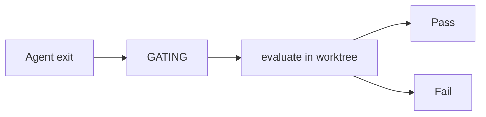

# Gate

Kit’s differentiator. After the agent stops, before the run may report done, Kit evaluates the **definition of done** in the run’s worktree.

## Why it exists

Agents lie or are wrong about “done”. The gate is mechanical proof: format / typecheck / test / extras.

## Sub-pages

- [[concepts/Gate/kit-toml|kit.toml]] — configuration
- [[concepts/Gate/firewall|Firewall]] — blast-radius screening
- [[concepts/Gate/vacuous-vs-real|Vacuous vs real]] — empty config policy
- [[concepts/Gate/outcome|GateOutcome]] — result shape for UI

## When it runs

## Engine

`kit-gate::KitGate` implements `kit_core::Gate`.  
Guardian fixtures are the acceptance oracle (M3 shipped).

## UI surfaces

- Control Room: GATE column + `^ first error` under FAIL
- Run Detail: Gate pane checklist
- Retry: append first failure into next task (planned)

## Status

Engine + fixtures shipped. Default inference for empty kit.toml and retry loop still need product lock-in for 1.0 quality.
