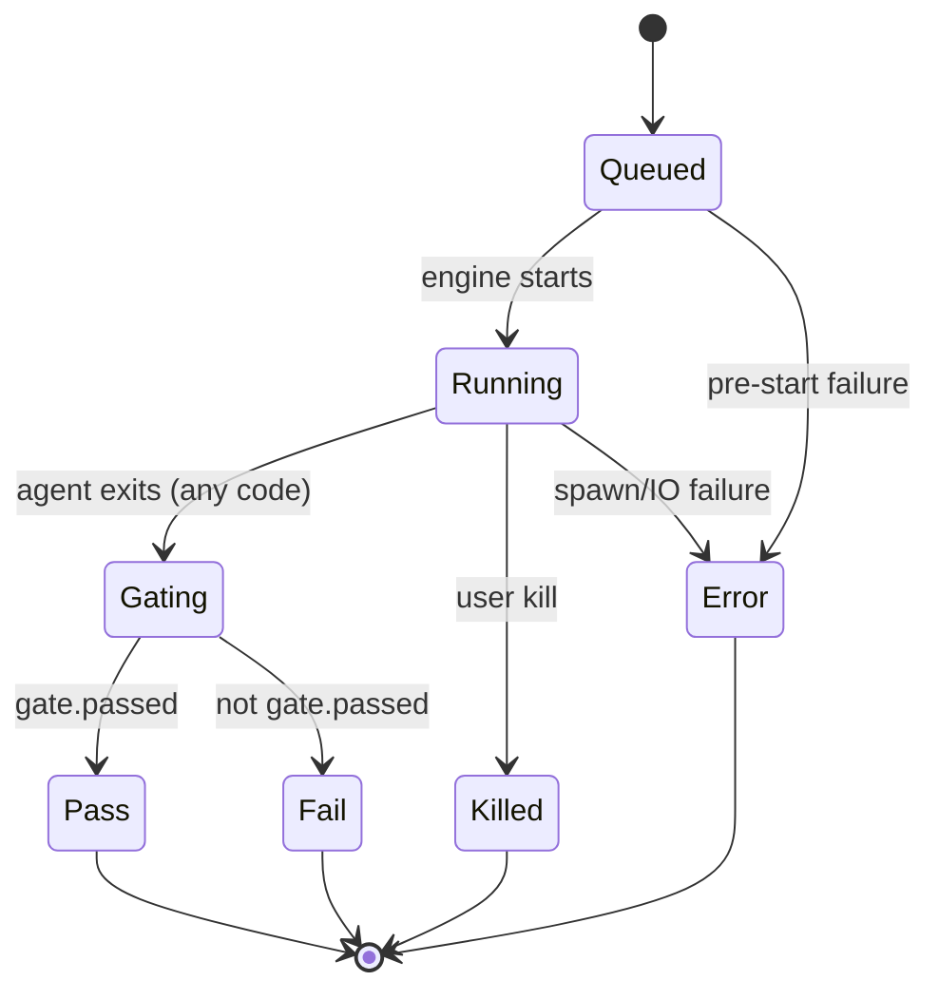

# Run Lifecycle

## State machine

## States (exact meanings)

| State | Meaning | Who may enter it |
|-------|---------|------------------|
| `Queued` | Accepted, not started | UI or CLI enqueue |
| `Running` | Agent process live (or dry-run stream) | **Engine only** |
| `Gating` | Agent stopped; gate evaluating | Engine only |
| `Pass` | Gate passed (terminal) | Engine only |
| `Fail` | Gate failed (terminal) | Engine only |
| `Killed` | User/system stop before natural end | Engine (on kill) |
| `Error` | Kit/adapter failure, not a gate fail | Engine |

## Invariants

1. UI must not set `Running` / terminal states without engine (today: Dispatch inserts `Queued`; engine advances).
2. Terminal states never leave (no un-done).
3. `Gating` is mandatory on the success path even if gate is vacuous — always produce a `GateOutcome` on receipt.
4. Agent non-zero exit currently maps to agent failure → `Error` if spawn path fails; gate still runs after dry/live agent phase returns ok flag — **spec clarification needed** for “agent failed but we still gate”.

## Retry (product)

`[r]etry` re-dispatches **same task** with gate failure summary appended as context.  
New RunId. Old receipt immutable.

**Status:** UI emits `RetrySelected`; engine not wired → planned.

## Kill (product)

`[k]ill` stops the agent process without waiting for natural exit → `Killed`.  
Worktree: keep if dirty; optional force-remove is a future policy.

**Status:** planned (needs process handle registry).
