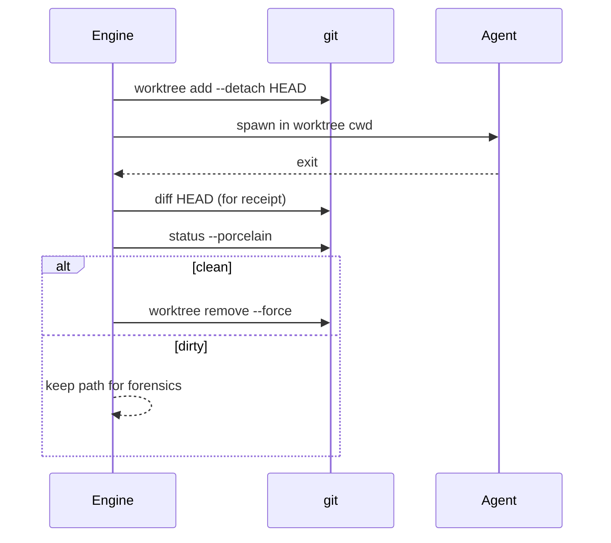

# Worktree

Every live [[concepts/Run/index|Run]] gets an **isolated git worktree** so agents cannot collide on one dirty tree.

## Location

```
$KIT_HOME/worktrees/<run-id>/   # default KIT_HOME = ~/.kit
```

Branch name: `kit/run-<short-id>` (local only).

## Lifecycle



## Rules

1. Target must be a **git** repository (hard fail otherwise).
2. Repo resolution: path, `.`, cwd basename match (Dispatch short names like `kit`).
3. Clean → remove; dirty → keep and surface path in CLI / receipt meta.
4. Never run agents in the user’s primary working tree for dispatch/run.

## Failure modes

| Failure | User-visible |
|---------|----------------|
| Not a git repo | Error naming the path + fix (“git init or pass --repo”) |
| worktree add fails | Error; no Running state |
| Nested KIT_HOME on weird drives | Document; prefer absolute KIT_HOME |

## Status

Shipped in `kit-cli` engine. Should eventually move toward `kit-core` store ownership (B1) without changing the UX contract.
