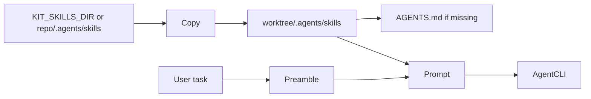

# Skill

A **markdown workflow** that shapes how an agent works (not the product itself).

## Role in 1.0

Skills are **substrate**:

- Injected into worktree as `.agents/skills/**`
- Summarized into the agent prompt via routing preamble (using-agent-skills)
- Optionally referenced by users in tasks

Kit vendors [addyosmani/agent-skills](https://github.com/addyosmani/agent-skills) (24 skills) under `.agents/skills`.

## Injection pipeline

## Resolution order

1. `KIT_SKILLS_DIR`
2. `<repo>/.agents/skills`
3. `<cwd>/.agents/skills`
4. Walk up from cwd

## Prompt preamble (must include)

- That Kit is the control room
- Skill routing table (spec → plan → implement → TDD → review)
- Core behaviors: assumptions, simplicity, scope, verify
- User task block
- Delivery expectations (small diffs, how to verify)

## v1.0 quality bar

- [x] Pack installed in repo
- [x] Copy into worktree on live run
- [x] Preamble on live run
- [ ] Optional skill tags on Dispatch (e.g. force `security-and-hardening`)
- [ ] Library browser

## Non-goals

Marketplace, verified publishers, social following.
