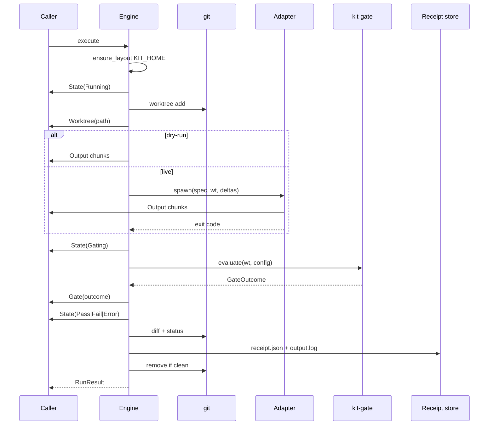

# Engine Pipeline

## `execute(opts, id?, tx?)` steps

## Dry-run vs live

| Mode | When | Agent body |
|------|------|------------|
| dry-run | `--dry-run` or binary missing (auto) | Synthetic transcript |
| live | binary on PATH (auto) or `--live` | Real CLI via adapter |

## Error mapping

| Failure | Result state |
|---------|--------------|
| Not git repo | Error (before Running ideally) |
| worktree add fails | Error |
| Agent missing + force live | fallback dry-run or Error |
| Agent exit ≠ 0 | agent_ok false → Error (today) |
| Gate fail | Fail |
| Gate pass | Pass |

## Gaps for v1.0

- [ ] Enforce Bounds.timeout with process kill
- [ ] Firewall wrap of agent-spawned commands (deep)
- [ ] Concurrent scheduler limits (max N runs)
- [ ] Structured error codes in RunResult JSON
