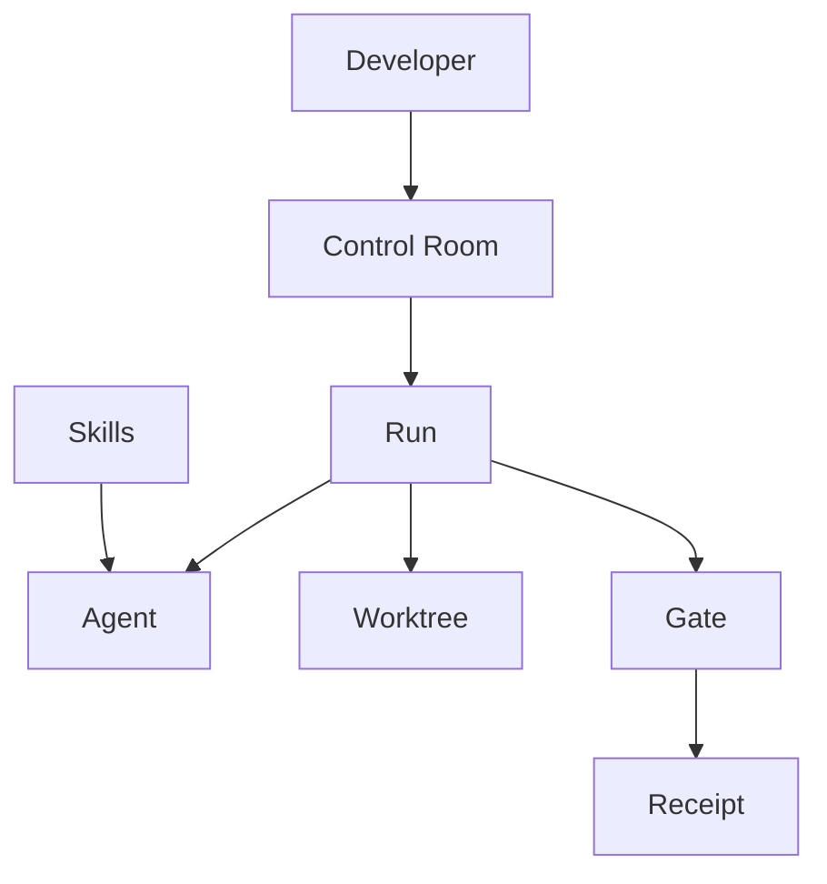

# Product

**Kit 1.0** is a local terminal **control room for parallel agent work**.

One line: **Dispatch many agents. Watch them in one place. Nothing ships unproven.**

## Sub-pages

- [[concepts/product/job-to-be-done|Job to be done]] — who, pain, wedge
- [[concepts/product/principles|Principles]] — six non-negotiables
- [[concepts/product/non-goals|Non-goals]] — cut for 1.0
- [[concepts/product/definition-of-done|Definition of done]] — ship bar

## Relationship to other concepts

- UI is a **view over** [[concepts/Run/index|Runs]].
- Trust comes from [[concepts/Gate/index|Gate]] + [[concepts/Receipt|Receipt]], not from the agent saying “done”.
- [[concepts/Skill|Skills]] are substrate (what you dispatch / how agents behave), not the product.

## Status

Core story is implemented enough to dogfood. High-quality **v1.0.0** requires control-plane completion and distribution (see [[concepts/roadmap/index|Roadmap]]).
