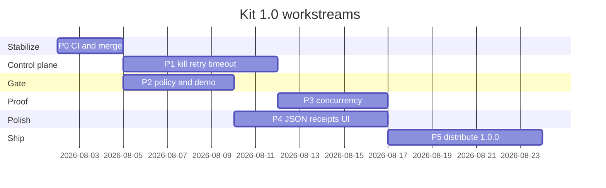

# Workstreams

Each workstream has **owner**, **exit criteria**, and **dependencies**. Do not start a later stream before its deps pass.

---

## P0 — Stabilize mainline

**Owner:** Claude (merge) + whoever broke CI  
**Deps:** none  

### Work

1. Land / fix PR #11 (Rust CI red on ubuntu/mac/windows — investigate first)
2. Ensure `cargo test --workspace` + clippy green on 3 OS
3. Freeze CURRENT.md against main after merge
4. Tag `v1.0.0-alpha.2` only after green

### Exit

- [ ] `main` builds kit-cli + kit-tui on CI 3 OS  
- [ ] Startup budget still green  
- [ ] No known data-loss bugs in receipt path  

---

## P1 — Control plane (must for “high quality”)

**Owner:** Grok + Codex (engine)  
**Deps:** P0  

### Features (full specs)

#### 1. Handle registry
See [[concepts/engine/handle-registry|Handle registry]].

#### 2. Kill
- Key `k` → EngineCommand::Kill  
- Process dies ≤2s  
- State `Killed` + receipt  
- Flash confirmation  

#### 3. Retry
- Key `r` only meaningful on Fail (optional allow Error)  
- New run, task = original + `\n\n## Previous gate failure\n` + summary  
- Same repo/agent  

#### 4. Bounds.timeout
- Soft warn at 80%; hard kill at 100%  
- Message in stream + receipt  

#### 5. Max concurrency
- Default 8  
- Excess stay Queued; start when slot free  
- Header shows queue depth optional  

### Exit

- [ ] Automated test: mock agent + kill  
- [ ] Manual: TUI kill live claude/grok  
- [ ] Retry produces second receipt  

---

## P2 — Gate trust

**Owner:** Claude (policy) + Grok (UI) + Codex (inference optional)  
**Deps:** P1 optional but preferred  

### Features

#### 1. Vacuous policy decision
Document and implement chosen option from [[concepts/Gate/vacuous-vs-real|Vacuous vs real]].

**Recommended:** infer defaults OR show `UNCONFIGURED` not PASS.

#### 2. Gate inference (if chosen)
Detect:

| Signal | Default checks |
|--------|----------------|
| `package.json` + pnpm-lock | format/typecheck/test scripts if present |
| `Cargo.toml` | `cargo test`, `cargo clippy -D warnings` optional |
| `go.mod` | `go test ./…` |

Never invent network-heavy checks.

#### 3. Demo failure path
Repo fixture or scripted `kit.toml` with failing check for 60s demo.

#### 4. Retry context quality
First failure line + command + exit code in retry prompt.

### Exit

- [ ] Demo: deliberate fail → FAIL in room → retry → pass or clear fail  
- [ ] JSON exposes vacuous flag  

---

## P3 — Concurrency & correctness proof

**Owner:** Codex (harness) + Grok (TUI)  
**Deps:** P1  

### Features

#### 1. Stress harness
- Spawn 8 dry-run or mock agents  
- Assert no interleaved receipt corruption  
- Assert frame/dirty policy holds (optional timing)

#### 2. Output isolation
Each run’s output only on its id; no cross-talk in UI buffers.

#### 3. Worktree collision
Parallel runs never share worktree paths (ULID).

### Exit

- [ ] CI job or local `cargo test` named `concurrency_eight`  
- [ ] Documented pass on Windows  

---

## P4 — Product completeness (thin)

**Owner:** Grok (TUI) + Codex (CLI JSON)  
**Deps:** P1–P2  

### Features

| Item | Spec pointer | Priority |
|------|--------------|----------|
| `doctor --json` | [[concepts/cli/json-contract]] | P0 for automation |
| `receipt show/list` | [[concepts/Receipt]] | P0 |
| SchemaVersion on JSON | [[concepts/cli/json-contract]] | P0 |
| Theme usable + reduced motion | surface principles | P1 |
| Dispatch path picker | [[concepts/surface/dispatch]] | P1 |
| Attach/PTY | [[concepts/surface/attach]] | P1 if time else 1.0.1 |
| Board durable file | [[concepts/surface/board]] | P2 |
| Library screen | [[concepts/surface/library]] | P2 optional |
| Mascot | brand | P3 after ship |

### Exit

- [ ] README walkthrough works cold  
- [ ] Keyboard-only complete journey without attach  

---

## P5 — Release (M5)

See [[concepts/roadmap/release|Release]].

**Deps:** P0–P3 green; P4 minimum JSON+receipts  

---

## Parallelism map

P1 and P2 can partially overlap after P0.
