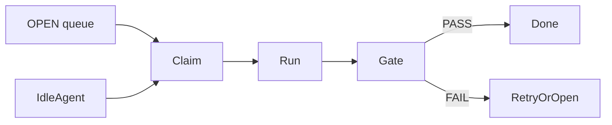

# Board

PRD: shared queue where agents **pull** the next task when free — turns dashboard into orchestrator.

## Two product interpretations

| Mode | Behavior | 1.0 recommendation |
|------|----------|-------------------|
| **A. Prefill queue** | Human-curated list; Enter opens Dispatch prefilled | Ship as MVP |
| **B. True pull queue** | Idle agents auto-claim next OPEN task | 1.0 stretch / 1.1 |

Today implements **A**.

## Data model (TUI-local today)

```
BoardTask { id, title, repo_hint, agent_hint, done }
```

Not yet durable on disk. Not yet linked to RunIds after claim.

## Keys

| Key | Action |
|-----|--------|
| n | New item (from dispatch task text or `task-#`) |
| ↑↓ | Select |
| Space | Toggle done |
| x / Del | Remove |
| Enter | Prefill Dispatch + open |
| d | Open Dispatch |
| Esc | Control Room |

## True Board (full concept for later)



Requirements if elevated to 1.0 must-have:

- Durable queue file under `~/.kit/board.json`
- Claim leases (prevent double claim)
- Link `board_task_id` → `run_id`s
- Backpressure when too many RUNNING

## Decision for high-quality 1.0

**Ship Board as Dispatch prefiller + visible backlog.**  
Do **not** block 1.0 on auto-pull orchestration (M4 kill criterion can be met by **manual fan-out** Dispatch to N repos). Document honestly.
