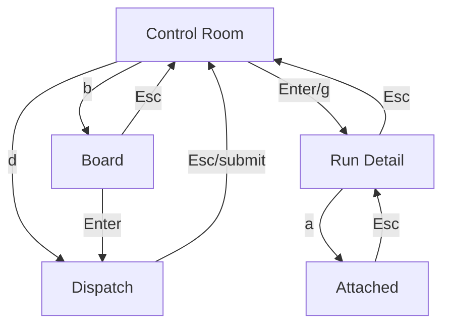

# Product Surface

Kit’s UI is a **terminal full-screen control room** (ratatui + crossterm + tokio).

## Screens

| Screen | Purpose | Status |
|--------|---------|--------|
| [[concepts/surface/control-room|Control Room]] | Default live table of runs | shipped |
| [[concepts/surface/run-detail|Run Detail]] | Stream / gate / diff | shipped (attach stub) |
| [[concepts/surface/dispatch|Dispatch]] | Fan-out form | shipped |
| [[concepts/surface/board|Board]] | Shared task queue | partial |
| [[concepts/surface/attach|Attach]] | PTY takeover | stub |
| [[concepts/surface/doctor|Doctor]] | Env readiness | CLI shipped; TUI screen planned |
| [[concepts/surface/library|Library]] | Local skills list | planned (minimal) |

## Global interaction rules

1. **Esc** always goes up one level (Attached → Detail → Control Room).
2. **Selection by RunId**, not row index — list never jumps under you.
3. **One clock** — no component timers (`AppEvent::AnimationTick` only).
4. **Footer grammar** consistent: bracketed single keys.
5. **q** quits from most screens; **disabled while Attached**.
6. Reduced motion: `NO_COLOR`, `KIT_MOTION=off`.

## Navigation map

## Architecture (surface)

- Pure reducer `App::update(AppEvent) -> Action`
- Navigation mutates `Screen` inside reducer
- Engine work leaves as `Action` / `DispatchJob` for CLI loop
